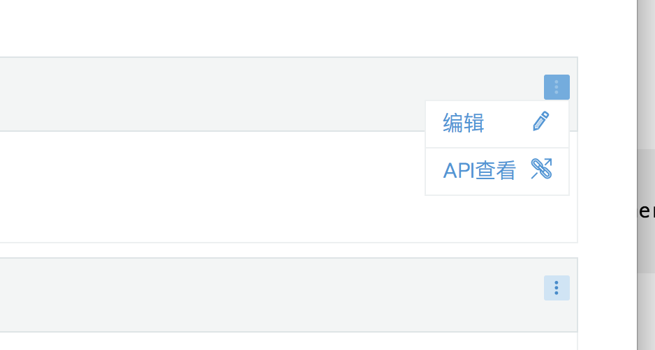

出于安全考虑，使用Rancher时需要配置SSL，SSL将加密所有Rancher通信：登录，群集交互等。

默认情况下，Rancher会生成一个自签名证书，用于加密端口443(HTTPS)上的通信.通过80端口(http)的所有流量都会自动转发到443端口(https)。

## 选择证书主机

有两个地方可以设置SSL证书:

- 在Rancher容器内部设置.
- 在外部负载均衡或者代理上设置.

## 在Rancher容器内部配置SSL证书

### 自动生成默认自签名证书

在没有任何参数的情况下运行`rancher/rancher` 容器，将在启动容器时自动创建自签名证书。

**例如**:

```bash
docker run -d -p 80:80 -p 443:443 rancher/rancher:v2.0.4
```

### 手动生成自签名证书

您可以使用自己的证书，让Rancherl使用它们来提供SSL加密。您可以通过在运行容器时挂载证书文件到容器中，证书文件应采用`.pem`格式, 确保您的证书文件包含链中的所有中间证书。

| 文件类型                         |               容器路径 |
| ---------------------------- | ---------------------------: |
| Certificate file             |    /etc/rancher/ssl/cert.pem |
| Certificate key file         |     /etc/rancher/ssl/key.pem |
| CA certificates file         | /etc/rancher/ssl/cacerts.pem |

**例如**:

```bash
docker run -d -p 80:80 -p 443:443 \
  -v /etc/your_certificate_directory/fullchain.pem:/etc/rancher/ssl/cert.pem \
  -v /etc/your_certificate_directory/privkey.pem:/etc/rancher/ssl/key.pem \
  -v /etc/your_certificate_directory/cacerts.pem:/etc/rancher/ssl/cacerts.pem \
  rancher/rancher:v2.0.4
```

### 使用权威的CA机构提供的证书

如果使用权威CA机构提供的证书，则只需将证书文件和证书密钥文件映射到容器。在这种情况下，不需要安装其他CA证书文件。

| Type                         |        Location in container |
| ---------------------------- | ---------------------------: |
| Certificate file             |    /etc/rancher/ssl/cert.pem |
| Certificate key file         |     /etc/rancher/ssl/key.pem |

**例如:**

```bash
docker run -d -p 80:80 -p 443:443 \
  -v /etc/your_certificate_directory/fullchain.pem:/etc/rancher/ssl/cert.pem \
  -v /etc/your_certificate_directory/privkey.pem:/etc/rancher/ssl/key.pem \
  rancher/rancher:v2.0.4
```

## 在外部负载均衡器或代理上配置SSL证书

**使用自签证书:**

使用自签名证书时，必须将CA证书添加到rancher/rancher容器中。

| Type                         |        Location in container |
| ---------------------------- | ---------------------------: |
| CA certificates file         | /etc/rancher/ssl/cacerts.pem |

**例如:**

```bash
docker run -d -p 80:80 -p 443:443 \
  -v /etc/your_certificate_directory/cacerts.pem:/etc/rancher/ssl/cacerts.pem \
  rancher/rancher:v2.0.0
```

**使用权威的CA机构提供的证书:**

如果使用的是权威的CA机构提供的证书，那么需要删除Rancher中默认自动生成的CA证书。通过在Rancher UI中选择`系统设置`,找到`cacerts`设置，选择... > 编辑，
然后清空内容，最后单击保存。
